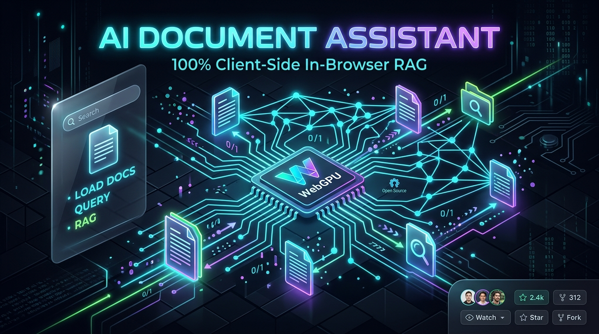
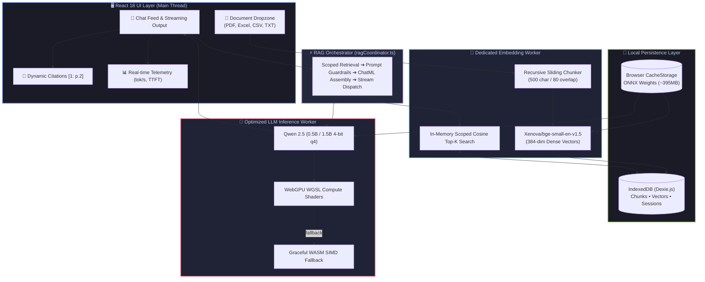

<div align="center">



<br/><br/>

# ⚡ AI Document Assistant

### **100% Client-Side • Zero-Server • Air-Gapped In-Browser RAG & Intelligence**

[](https://www.w3.org/TR/webgpu/)
[](https://www.typescriptlang.org/)
[](https://reactjs.org/)
[](https://vitejs.dev/)
[](https://github.com/Nandha21028/AI_Document_Assistant/actions)
[](#-privacy--security-guarantee)
[](LICENSE)

<br/>

<p align="center">
  <b>Chat with your confidential PDFs, Excel sheets, CSVs, and Markdown files completely offline.</b><br>
  No API keys. No subscriptions. No cloud servers. No data leakage — guaranteed by the laws of physics.
</p>

[✨ Key Features](#-key-features) • [⚔️ Why In-Browser RAG?](#-in-browser-rag-vs-cloud-rag) • [🏗️ Architecture](#-system-architecture) • [🚀 Quick Start](#-quick-start) • [🤖 Model Matrix](#-supported-models--hardware) • [📂 Codebase Tour](#-project-structure)

<br/>

</div>

---

## 💡 The Breakthrough: In-Browser RAG vs Cloud RAG

Traditional RAG stacks upload your confidential corporate documents to remote servers (OpenAI, Pinecone, LangChain) incurring recurring costs, latency, and privacy compliance risks. 

**AI Document Assistant executes the entire RAG pipeline directly inside the user's browser sandbox:**

| Feature | ☁️ Traditional Cloud RAG | ⚡ AI Document Assistant (On-Device) |
| :--- | :--- | :--- |
| **Data Privacy** | Files uploaded to 3rd-party servers | **100% Private**. Zero bytes leave client RAM |
| **API Costs & Subscriptions** | $0.002 - $0.06 per query + Vector DB fees | **$0.00 Forever**. Free and open-source |
| **Air-Gap / Offline Mode** | ❌ Fails completely without internet | **✅ Fully operational on airplane mode** |
| **Vector Storage** | Remote SaaS (Pinecone, Milvus, Qdrant) | **IndexedDB (Dexie.js)** with browser persistence |
| **Compute Engine** | Expensive Cloud H100/A100 instances | **Client WebGPU Compute Shaders** (or WASM SIMD) |
| **Document Ingestion** | Slow upload + remote pipeline queue | **Instant client-side parsing & chunking** |
| **Inline Source Grounding** | Vague or missing citations | **Interactive badges `[1: p.2]` with raw text inspection** |

---

## ✨ Key Features

<table>
  <tr>
    <td width="50%">
      <h3>🔒 100% Air-Gapped Privacy</h3>
      <p>Documents are parsed strictly within client JavaScript memory. Disconnect your Wi-Fi after initial model load; the entire application runs without a network interface.</p>
    </td>
    <td width="50%">
      <h3>⚡ WebGPU Hardware Acceleration</h3>
      <p>Direct compute shader pipelines for lightning-fast token generation. Features 1-token WGSL shader pre-warming and automatic fallback to WebAssembly SIMD.</p>
    </td>
  </tr>
  <tr>
    <td width="50%">
      <h3>🧠 On-Device SLM (Qwen 2.5)</h3>
      <p>Runs Alibaba's <b>Qwen 2.5 (0.5B & 1.5B Instruct)</b> 4-bit quantized (<code>q4</code>) models natively using ONNX Runtime Web with ChatML templating.</p>
    </td>
    <td width="50%">
      <h3>📐 384-Dim Dense Embeddings</h3>
      <p>Powered by <code>Xenova/bge-small-en-v1.5</code> running in an isolated Web Worker for sub-millisecond semantic similarity without blocking UI rendering.</p>
    </td>
  </tr>
  <tr>
    <td width="50%">
      <h3>📑 Multi-Format Document Ingestion</h3>
      <p>Drag-and-drop parsing for <b>PDFs</b> (<code>pdfjs-dist</code>), <b>Excel sheets (.xlsx, .xls)</b>, <b>CSVs</b>, and <b>Markdown / Text files</b> with page-accurate chunking.</p>
    </td>
    <td width="50%">
      <h3>🎯 Interactive Source Citations</h3>
      <p>Responses include verified clickable citation badges (e.g. <code>[1: p.2]</code>). Click any badge to open the <b>Source Preview Modal</b> with exact document excerpts.</p>
    </td>
  </tr>
  <tr>
    <td width="50%">
      <h3>💾 Persistent Vector Database</h3>
      <p>Zero external databases needed. Document vectors, extracted text chunks, and chat sessions are stored in <b>IndexedDB via Dexie.js</b> with JSON export/import backup.</p>
    </td>
    <td width="50%">
      <h3>📊 Real-Time Telemetry & Benchmarks</h3>
      <p>Inspect live generation telemetry: <b>Tokens/sec</b>, <b>Time-to-First-Token (TTFT)</b>, memory utilization, and an integrated 64-token GPU speed benchmark runner.</p>
    </td>
  </tr>
</table>

---

## 🏗️ System Architecture



---

## 🚀 Quick Start

Get up and running in **under 2 minutes**:

### 1. Prerequisites
- **Node.js**: `v18.0.0` or higher
- **WebGPU-Enabled Browser**: Chrome 113+, Microsoft Edge 113+, Brave, or Arc.

### 2. Installation
```bash
# Clone the repository
git clone https://github.com/Nandha21028/AI_Document_Assistant.git

# Enter project directory
cd AI_Document_Assistant

# Install dependencies
npm install
```

### 3. Launch the App
```bash
# Run local development server
npm run dev
```
Navigate to `http://localhost:3000` in your browser.

### 4. Build for Production
```bash
npm run build
npm run preview
```

---

## 🤖 Supported Models & Hardware

All models are downloaded **once** from Hugging Face Hub directly into your browser's persistent `CacheStorage`. On subsequent visits, they load **instantly from disk** with zero network transfer.

| Model | Parameters | Quantization | Cache Size | Recommended Hardware | Execution Backend |
| :--- | :--- | :--- | :--- | :--- | :--- |
| **Qwen 2.5 0.5B Instruct** *(Default)* | 0.5 Billion | `q4` (4-bit) | ~350 MB | Any modern PC / Mac / Integrated GPU | WebGPU *(WASM fallback)* |
| **Qwen 2.5 1.5B Instruct** | 1.5 Billion | `q4` (4-bit) | ~950 MB | Discrete GPU (NVIDIA / AMD) or Apple Silicon M1+ | WebGPU |
| **BGE Small EN v1.5** | 33 Million | INT8 ONNX | ~45 MB | Runs smoothly on any CPU/thread | Transformers.js Worker |

<details>
<summary><b>🔍 How to check WebGPU support in your browser</b></summary>

1. Open your browser console (`F12` or `Ctrl + Shift + I`).
2. Type `navigator.gpu` and hit Enter.
3. If it returns `GPU {}`, WebGPU is fully supported and active!
4. *(Optional)* On Chrome, visit `chrome://gpu` to verify hardware acceleration status.
</details>

---

## 📂 Project Structure

```bash
AI_Document_Assistant/
├── docs/                             # Architectural blueprints & engineering guides
│   ├── assets/                       # Visual assets, banners & diagrams
│   ├── architecture.md               # End-to-end system design
│   ├── model-strategy.md             # SLM selection, quantization & weights
│   ├── rag-pipeline.md               # 5-stage ingestion-to-attribution spec
│   └── security.md                   # Threat model & air-gapped guarantees
├── src/
│   ├── ai/                           # AI & Inference Engine
│   │   ├── embeddings/               # BGE vector pipeline & L2 normalization
│   │   ├── inference/                # WebGPU execution runner & warmup shaders
│   │   ├── models/                   # Model registry & memory allocation
│   │   ├── prompts/                  # ChatML prompt templates & strict anti-hallucination
│   │   ├── rag/                      # ragCoordinator.ts (Master orchestrator)
│   │   └── retrieval/                # Scoped cosine similarity & top-K ranking
│   ├── components/                   # UI building blocks & modal managers
│   │   ├── Header.tsx                # Status pills, Qwen badge, WebGPU badge
│   │   ├── HardwareModal.tsx         # GPU speed benchmark runner (tok/s test)
│   │   ├── ModelManagerModal.tsx     # Download progress & cache inspection
│   │   └── StorageModal.tsx          # IndexedDB quota gauge & JSON backups
│   ├── storage/                      # Dexie.js IndexedDB schema, repositories & quota
│   ├── documents/                    # Document ingestion engine
│   │   ├── chunking/                 # Recursive character text splitter (500c/80o)
│   │   ├── metadata/                 # BPE token estimator
│   │   └── parsers/                  # PDF, Excel (.xlsx), CSV, and Plaintext parsers
│   ├── features/                     # Core user experience modules
│   │   ├── chat/                     # Chat feed, composer, and citation renderer
│   │   ├── documents/                # Dropzone, document cards, chunk visualizer
│   │   ├── sessions/                 # Multi-session state management
│   │   └── sources/                  # Citation inspector & semantic search lab
│   └── workers/                      # Web Worker threads (LLM & Embeddings offload)
├── package.json                      # Dependency manifest
├── tailwind.config.js                # Tailwind styling configurations
└── vite.config.ts                    # Optimized Vite bundler configuration
```

---

## 🛡️ Privacy & Security Guarantee

- **Zero Cloud Leakage**: No telemetry, no usage statistics, no tracking pixels.
- **Client-Only Processing**: Your documents exist only in browser memory and local IndexedDB.
- **Air-Gapped Compliance**: Fully functional in secure offline environments, defense, healthcare, and legal sectors where data upload is strictly prohibited.

---

## 🤝 Contributing

We welcome contributions from the open-source community! 

1. **Fork the repo** (`https://github.com/Nandha21028/AI_Document_Assistant`)
2. **Create your feature branch**: `git checkout -b feature/AmazingFeature`
3. **Commit your changes**: `git commit -m 'feat: add AmazingFeature'`
4. **Push to the branch**: `git push origin feature/AmazingFeature`
5. **Open a Pull Request**

---

## 📄 License

This project is licensed under the **MIT License** - see the [LICENSE](LICENSE) file for details.

---

<div align="center">

Crafted with 💜 for open, private, on-device AI by **[Nandha21028](https://github.com/Nandha21028)**

**⭐ Star this repo if you find on-device AI exciting! ⭐**

</div>
